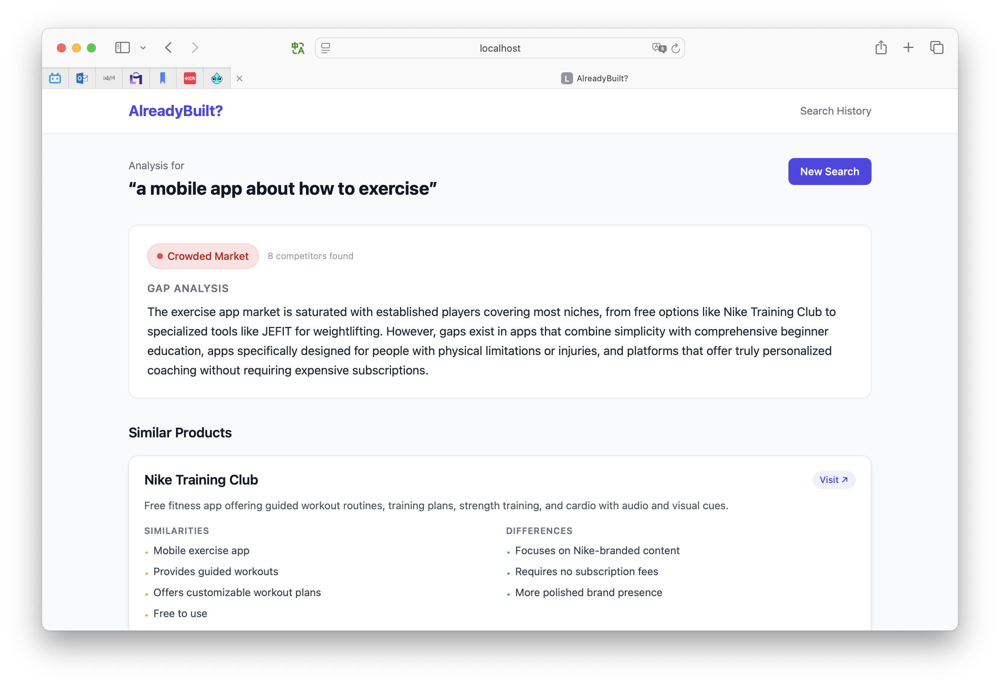
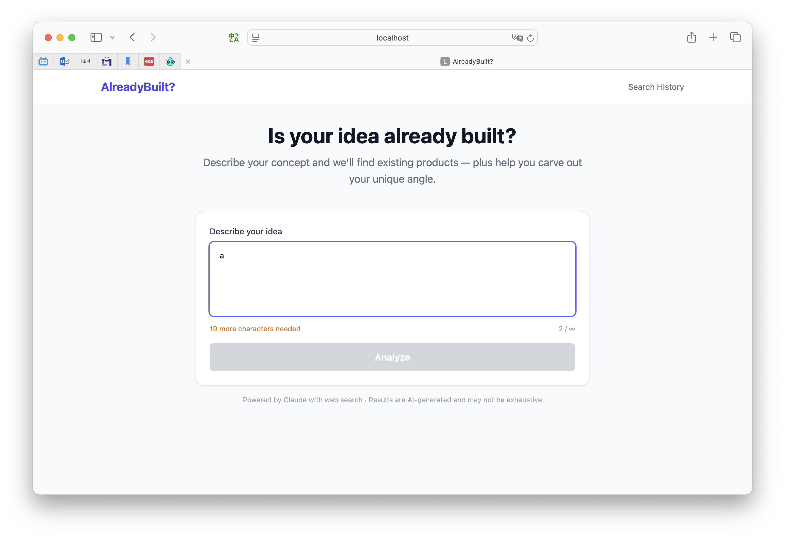
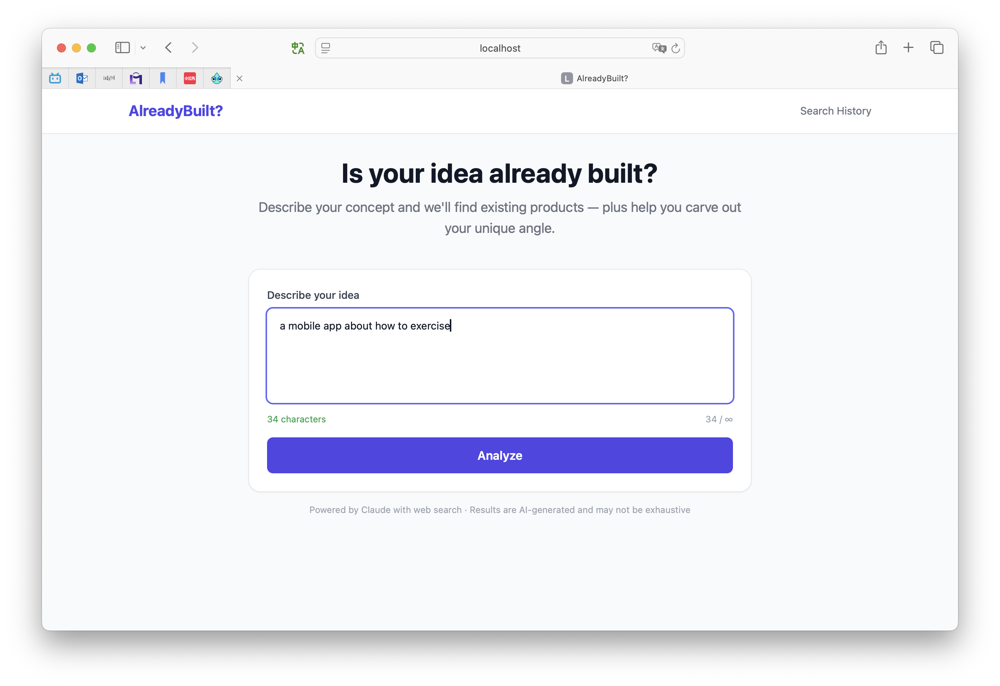
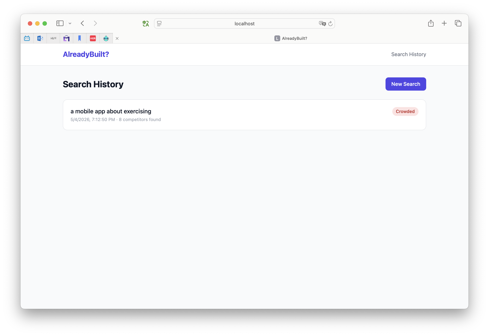

# Bug Reports — Mid-point Check

> Filed by: Sijia Shao (Client) · Date: 2026-05-04
> Repo: https://github.com/GIX-Luyao/final-project-codebase-FishShao
> Tested branch: `main` (PRs #1–#5 merged; PR #6 open and pending feedback)
> Each entry below follows the project's `bug-report-template.md` format. File these as separate GitHub Issues.

---

## [Bug #1] Competitor comparison shown as plain text, not as a visual chart (PR #6 client feedback unaddressed)

### Steps to Reproduce

1. Check out `feature/issue-6-differentiation` (the PR #6 branch) — or wait until it's merged into `main`
2. Run `npm install && npm run dev`, add `ANTHROPIC_API_KEY` to `.env.local`
3. Submit any idea on the home page (e.g. *"a mobile app about how to exercise"*)
4. On the results page, scroll through the **Similar Products** section

### Expected Behavior

Per the client's review on PR #6 (2026-05-04), the comparison should be rendered as a visual chart, not as stacked text cards. Specifically:

- Each company / product appears as a circle / node in a chart
- Hover shows a tooltip with company name, short description, similarity score, and positioning
- Click opens a detailed analysis panel with similarities, differences, and gap analysis
- Layout lets a viewer identify clusters, overlaps, whitespace opportunities, and competitive density within ~30 seconds

The data model also needs a `similarity_score` field on `Competitor` — currently absent from `lib/types.ts:1-7`.

### Actual Behavior

Each competitor renders as a stacked text card with two bullet-list columns ("Similarities" / "Differences"). No chart, no hover interaction, no click-through panel, no similarity score. With 8 competitors the list is too long to read "at a glance".

PR #6 is currently blocked on this feedback — it cannot be merged as-is.

### Severity

- [ ] Blocker
- [x] **Major** — This is the headline UX of the product per the client's review. Blocks PR #6 merge.
- [ ] Minor

### Evidence



Source: `app/results/[id]/page.tsx:32-80` on the PR #6 branch (`CompetitorCard` is plain text + bullet lists).

### Environment

| Detail | Value |
|---|---|
| Browser | Safari |
| Device | Desktop |
| OS | macOS 15 (Darwin 24.2) |
| Deployed or local? | localhost:3000 |

### Related Issue

Related to #6 (comparison rendering) and the client review comment on PR #6.

---

## [Bug #2] Idea-input character counter displays `N / ∞` — confusing, no real maximum

### Steps to Reproduce

1. Open `http://localhost:3000`
2. Look at the bottom-right of the "Describe your idea" textarea
3. Type any string and watch the counter update

### Expected Behavior

Either show only the current character count (e.g. `34 characters`), or show `current / max` with a real maximum that matches a server-enforced limit. No `∞` glyph — it is visually noisy and conveys nothing actionable.

### Actual Behavior

The counter renders as `2 / ∞`, `34 / ∞`, etc. The left-side message ("19 more characters needed" / "34 characters") already communicates the validation state, so the right-side `/ ∞` counter is redundant dead pixels.

Source: `app/page.tsx:89` — `<span className="text-xs text-gray-400">{idea.length} / ∞</span>`.

### Severity

- [ ] Blocker
- [ ] Major
- [x] **Minor** — Cosmetic. Fix when time allows.

### Evidence

Empty / underflow state — counter shows `2 / ∞`:



Valid state — counter shows `34 / ∞`:



### Environment

| Detail | Value |
|---|---|
| Browser | Safari |
| Device | Desktop |
| OS | macOS 15 (Darwin 24.2) |
| Deployed or local? | localhost:3000 |

### Related Issue

Related to #2 (idea input form).

---

## [Bug #3] Search history is lost on server restart — Supabase persistence layer not implemented

### Steps to Reproduce

1. Run `npm run dev`, submit two or three different ideas so the history has content
2. Click **Search History** in the header — confirm the list is populated
3. Stop the dev server (`Ctrl+C`) and restart it with `npm run dev`
4. Click **Search History** again

### Expected Behavior

Per the original tech-stack table in `README.md`:

> **Database + Auth: Supabase** — Provides Postgres, row-level security, and Auth out of the box.

Searches should persist across restarts. The acceptance criterion for Issue #7 explicitly says "search history saved to Supabase".

### Actual Behavior

The history page renders the empty state ("No searches yet · Analyze your first idea →"). Every search submitted before the restart is gone.

Root cause: `app/history/page.tsx:19` reads from `getAllSearches()` in `lib/store.ts`, which is an in-memory `global._searchStore` array. There is no Supabase client, no DB schema, and no persistence code. `package.json` does not list `@supabase/supabase-js` — only `@anthropic-ai/sdk`, `next`, and `react`.

The PR #7 (`feature/issue-7-polish`) branch adds an env-config example and a `web_search` tool fix, but does not introduce Supabase either. So as of mid-point, the persistence layer is still entirely missing.

### Severity

- [ ] Blocker
- [x] **Major** — Spec deviation that blocks Issue #7 and breaks the demo story (showing a history of analyzed ideas across sessions).
- [ ] Minor

### Evidence

History page populated **before** restart (1 entry visible):



Code reference:

```ts
// lib/store.ts
if (!global._searchStore) {
  global._searchStore = [];
}
const store = global._searchStore;
```

`package.json` dependencies (no Supabase package present):

```json
"dependencies": {
  "@anthropic-ai/sdk": "^0.40.0",
  "next": "14.2.5",
  "react": "^18",
  "react-dom": "^18"
}
```

### Environment

| Detail | Value |
|---|---|
| Browser | Safari |
| Device | Desktop |
| OS | macOS 15 (Darwin 24.2) |
| Deployed or local? | localhost:3000 (also reproducible on Vercel cold start) |

### Related Issue

Related to #7 (search history feature). Blocks any future user-account / multi-device functionality. Shares root cause with Bug #4 below.

---

## [Bug #4] Shared `/results/[id]` URLs return 404 after server restart (and on serverless cold starts)

### Steps to Reproduce

1. Run `npm run dev`
2. Submit a valid idea on the home page
3. Once redirected to `/results/<some-uuid>`, copy the URL
4. Stop the dev server (`Ctrl+C`) and restart it with `npm run dev`
5. Paste the URL back into the browser

### Expected Behavior

The previously-generated analysis should still load. Result URLs should be shareable / revisitable — that is the implicit contract of the `/results/[id]` URL pattern.

### Actual Behavior

Next.js renders the default 404 page. The result is gone.

Same root cause as Bug #3 — `lib/store.ts` keeps results in `global._searchStore`, which is wiped on every process restart. On Vercel, this also manifests on serverless cold starts: each invocation may run in a fresh isolate, so a user can hit a 404 minutes after creating a search even without an explicit redeploy.

### Severity

- [ ] Blocker
- [x] **Major** — Breaks shareable URLs and produces silent data loss.
- [ ] Minor

### Evidence

Same code root cause as Bug #3 — `lib/store.ts` is in-memory:

```ts
if (!global._searchStore) {
  global._searchStore = [];
}
const store = global._searchStore;
```

(Reproducing locally: visit `/results/<uuid>` → kill server → restart → same URL returns Next.js' default 404 page.)

### Environment

| Detail | Value |
|---|---|
| Browser | Safari |
| Device | Desktop |
| OS | macOS 15 (Darwin 24.2) |
| Deployed or local? | localhost:3000 (also reproducible on Vercel cold start) |

### Related Issue

Related to #7 (search history persistence). Shares root cause with Bug #3 — fixing the Supabase integration resolves both.
